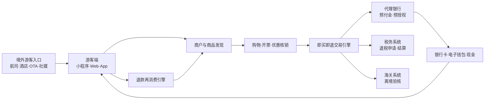

# 构建入境游客购物基础设施和营销平台 v0.1

> 版本：v0.1  
> 更新日期：2026-10-08  
> 核心场景：中国境内“即买即退”  
> 文档定位：商业模式、产品架构与落地路线第一版

## 1. 执行摘要

本项目不应只定位为“退税工具”，而应定位为：

> 以即时退税为支付入口，连接入境游客、商户、代理银行、税务、海关、支付机构和旅游渠道的购物基础设施与营销平台。

“即买即退”将原本离境时发生的退款提前到购物现场，使游客在中国境内立即获得可再次消费的资金。平台由此获得三个关键入口：

1. **游客入口**：识别入境游客身份、行程与消费意图；
2. **商户入口**：连接退税商店、商品、发票、优惠和会员系统；
3. **交易入口**：连接预授权、预付金、海关验核、银行结算和退款状态。

平台长期收入不应主要依赖退税手续费或隐藏汇率差，而应来自软件服务、交易技术、商圈运营、商户导流、支付合作和合规数据服务。

核心商业闭环：

```text
游客第一次购物
→ 获得即时退税预付金
→ 平台发放定向优惠
→ 游客继续在境内消费
→ 商户销售增长
→ 商户和银行为平台服务付费
```

## 2. 政策和经营边界

### 2.1 法定退税主体

现行制度下，申请成为离境退税代理机构的主体是符合条件的银行。代理银行需要具备口岸设施、退税信息系统、合规记录，并愿意先行垫付退税资金；最终由省级税务局会同财政、海关等部门遴选并公告。

因此，本项目更现实的角色是：

> 代理银行的技术平台、商户网络运营方、游客产品运营方和口岸服务提供商。

平台不替代银行成为法定退税代理机构，不自行沉淀游客资金，不无牌从事支付清算或外汇兑换。

### 2.2 资金不落地原则

- 退税预付金由代理银行直接支付给游客；
- 信用卡预授权由银行或持牌收单机构执行；
- 税务退税资金由代理银行申请结算；
- 平台传输交易指令、审核结果和业务状态；
- 平台服务费通过独立B2B合同结算。

### 2.3 即买即退不是流程终点

游客在购物现场收到的是有条件的退税预付金。其后仍需在规定期限内离境，携带商品、发票、退税申请单和有效证件接受海关验核，再由退税代理机构完成审核并解除信用卡预授权。

游客未按要求完成离境验核时，代理机构可以通过预授权追回预付金。因此，“离境任务管理”必须是核心产品能力。

## 3. 参与方与价值主张

| 参与方 | 当前痛点 | 平台价值 |
|---|---|---|
| 入境游客 | 不知道哪里可退、实际退多少、机场怎么办 | 多语言导购、透明试算、即时到账、离境提醒、进度追踪 |
| 退税商店 | 流程复杂、重复录入、培训成本高 | POS插件、自动开单、身份校验、退货联动、统一对账 |
| 商场与品牌 | 难识别境外游客、难衡量营销效果 | 游客流量、优惠投放、二次消费、经营分析 |
| 代理银行 | 获客成本高、系统分散、口岸运营重 | 统一平台、风控、商户网络和游客运营 |
| 税务与海关 | 数据质量和异常交易风险 | 标准数据、实时状态、规则校验、审计追踪 |
| 航司、酒店、OTA | 缺少入境购物产品 | 购物权益、退税进度和联合营销 |
| 支付机构 | 缺少明确入境消费场景 | 预授权、退款和支付路由交易量 |

## 4. 总体平台架构



平台分为六层：

1. **流量层**：航司、酒店、OTA、机场、商场、支付App和海外社媒；
2. **游客产品层**：身份、地图、试算、优惠、进度和离境任务；
3. **商户基础设施层**：POS、发票、退税申请单、退货和对账；
4. **交易风控层**：预授权、预付金、状态机、异常审核和追偿；
5. **机构连接层**：代理银行、税务、海关、持牌支付机构；
6. **营销数据层**：游客分群、优惠投放、归因、复购和经营分析。

## 5. 游客端产品

优先采用多语言移动网页、微信小程序和支付宝小程序，避免要求短期游客下载独立App。

### 5.1 购物前

- 护照扫描与退税资格初步判断；
- 可退税商店和“即买即退”网点地图；
- 最低消费门槛和适用商品说明；
- 应退税额、代理手续费和实退金额试算；
- 支持的银行卡、电子钱包及退款方式；
- 品牌、商场和目的地优惠；
- 距离预计离境日期的倒计时。

金额必须透明展示：

```text
商品含税价格：10,000元
政策应退税额：1,100元
代理手续费：200元
预计实退金额：900元
今日可领取预付金：900元
```

### 5.2 购物中

游客出示动态二维码，按最小必要原则授权商户读取证件、国籍或地区、最后入境日期、预计离境日期及口岸、退款方式和会员权益，避免每家商店重复采集护照。

### 5.3 购物后

建立个人“离境退税任务中心”：

- 待完成退税单和需要携带的商品；
- 发票、申请单和身份材料；
- 机场海关与退税柜台位置；
- 是否应在托运行李前验货；
- 最晚办理时间；
- 预授权、海关验核和最终完成状态。

通过短信、邮件、WhatsApp或平台消息，在离境前72小时、24小时和6小时提醒。

## 6. 商户基础设施

### 6.1 收银端

提供POS插件、SaaS网页和轻量商户小程序，支持：

- 护照OCR或芯片读取；
- 游客资格和商品规则校验；
- 发票信息自动关联；
- 应退额、手续费和实退额计算；
- 电子退税申请单生成；
- 信用卡预授权和预付金支付；
- 退货、红冲与退税单联动作废；
- 电子凭证和多语言说明。

### 6.2 商户后台

- 退税销售额、订单量和客单价；
- 国籍、语言和获客渠道分布；
- 热门商品与品类；
- 优惠券领取、到店与核销；
- 海关验核完成率；
- 逾期未离境和预授权追回订单；
- 银行及平台结算对账；
- 员工操作质量和异常订单。

商户付费的核心理由不是“能开退税单”，而是平台能够证明其带来的外国游客、销售增长和二次消费。

## 7. 即买即退交易引擎

### 7.1 正常状态流

```text
创建订单
→ 身份与资格验证
→ 发票开具
→ 退税申请单生成
→ 信用卡预授权
→ 代理银行发放预付金
→ 等待离境
→ 海关验核
→ 代理机构审核
→ 解除预授权
→ 税务结算
→ 订单完成
```

### 7.2 异常状态流

```text
退货 → 发票红冲或作废 → 退税单同步作废 → 收回预付金
逾期未离境 → 提醒与人工复核 → 执行预授权扣款
海关拒绝验核 → 记录原因 → 执行预授权扣款
支付失败 → 更换合规退款渠道 → 保留完整审计记录
```

### 7.3 统一交易标识

每笔业务使用统一交易ID，关联护照与游客账户、入境及预计离境信息、商户与商品、发票、退税申请单、信用卡预授权、预付金、海关验核、银行审核和税务结算。

## 8. 银行与支付合作

| 事项 | 代理银行 | 平台 |
|---|---|---|
| 法定退税代理资格 | 负责 | 不承担 |
| 预付金垫付 | 负责 | 发起技术指令 |
| 信用卡预授权 | 银行或收单机构 | 流程编排和状态管理 |
| 最终退款审核 | 负责 | 自动初审和材料整理 |
| 税务资金结算 | 负责 | 数据、对账和报表 |
| 商户拓展 | 共同 | 主导执行 |
| 游客产品 | 支持 | 主导 |
| 多语言客服 | 可委托 | 运营 |
| 风险政策 | 最终确认 | 模型和系统建设 |

第一阶段优先合作一家代理银行和一家收单机构；交易和流程稳定后，再扩展多银行、多银行卡和多钱包能力。

## 9. 营销与退款再消费

即时退款最大的增量价值，是游客仍在中国境内时获得可再次消费的资金。

### 9.1 再消费产品

- 本商场二次消费券；
- 跨店满减券；
- 指定品牌折扣；
- 餐饮、景点和交通权益；
- 酒店延住、行李寄存和机场接送；
- 下一家退税商店推荐；
- 基于语言和消费品类的个性化推荐。

### 9.2 典型闭环

```text
游客完成第一次购物
→ 即时获得900元退税预付金
→ 平台发放“再消费满1,000减100”
→ 游客在同一商圈完成第二笔消费
→ 平台完成渠道归因
→ 商户按成交或核销结果付费
```

### 9.3 流量入口

- 航空公司订票、值机和登机提醒；
- 酒店预订、入住和Wi-Fi页面；
- Trip.com等OTA；
- 机场到达大厅和机场交通；
- 支付宝、微信支付和银联国际；
- 境外银行App和银行卡权益页；
- 旅行社、导游和邮轮；
- 商场、品牌及文旅机构官网；
- Google Maps及海外社交媒体。

对外产品可采用“China Shopping Pass”类定位，将购物地图、优惠、翻译、支付、退税和离境提醒整合为一个入口。

## 10. 商业模式

| 收入来源 | 付费方 | 收费方式 |
|---|---|---|
| 系统实施费 | 代理银行、商场 | 项目制 |
| 年度SaaS费 | 银行、商户 | 年费或门店费 |
| 交易技术服务费 | 银行、商户 | 按成功订单计费 |
| 商圈和口岸运营费 | 银行、政府项目 | 固定运营费 |
| 支付技术合作收入 | 银行、持牌支付机构 | 合规分润 |
| 游客导流佣金 | 商户、品牌 | CPS或到店计费 |
| 优惠券营销服务 | 商场、品牌 | 核销费或活动费 |
| 广告和推荐位 | 品牌、商户 | 展示、点击或周期收费 |
| 数据分析服务 | 商场、文旅机构 | 订阅或专项报告 |
| API服务 | OTA、酒店、航司 | 调用量或年度授权 |

收入原则：不依赖隐藏汇率差；法定退税费用与商业优惠明确分开；支付、外汇和清算由持牌机构执行；游客画像和营销取得适当授权。

## 11. 风控与合规

### 11.1 游客风险

- 同一护照多账户；
- 伪造、冒用或过期证件；
- 入境日期不符合；
- 高频购买后集中退货；
- 多次领取预付金但不离境；
- 信用卡与游客身份严重异常；
- 团伙购买高价值易转售商品。

### 11.2 商户风险

- 虚构销售；
- 不符合条件的商品申报；
- 发票金额与实付金额不一致；
- 退货后未作废退税申请；
- 同一发票重复提交；
- 商户、员工与游客串通套取预付金。

### 11.3 平台控制

- 护照、设备及银行卡关联；
- 商户、商品和订单风险评分；
- 高价值订单人工复核；
- 离境概率和逾期预警；
- 退货及异常核销模型；
- 全链路操作日志；
- 资金指令双重校验；
- 权限分级和定期审计。

### 11.4 数据保护

护照、银行卡、出入境和消费记录均为高敏感信息。平台应实施最小化采集、明确授权、敏感字段及传输加密、用途隔离、租户隔离、严格权限、访问日志、保存期限和删除机制；涉及数据跨境时单独评估。

## 12. MVP落地路线

### 阶段一：单商场验证（0—6个月）

- 合作1家代理银行和1家收单机构；
- 选择1个入境游客集中的商场；
- 接入20—50家商户；
- 支持中文、英文和1—2种重点客源国语言；
- 打通身份、开票、退税单、预授权、预付金和离境提醒；
- 暂不建设复杂的多银行、多钱包和跨城市能力。

MVP必须包含：资格判断、金额试算、商户开单、信用卡预授权、银行预付金、离境任务中心、海关状态、预授权解除或扣回、对账以及基础营销归因。

### 阶段二：城市级平台（6—18个月）

- 建立市中心集中退付点；
- 接入机场柜台或自助终端；
- 扩展酒店、OTA和航司入口；
- 建立多商场通用游客账户；
- 接入更多银行卡和电子钱包；
- 上线商户营销后台；
- 建立完整人工审核和客服中心。

### 阶段三：跨城市和跨口岸（18个月以后）

- 支持异地购物、异地离境；
- 建立全国统一游客账户；
- 支持多家代理银行路由；
- 接入多个口岸验核状态；
- 扩展全球银行卡和钱包；
- 建设全国商户、商品和优惠网络；
- 建立面向航司、OTA及海外金融机构的开放API。

## 13. 核心指标

### 13.1 交易指标

- 成功订单数、退税交易总额和平均办理时长；
- 预付金发放成功率；
- 海关验核完成率；
- 预授权自动解除率和扣回率；
- 欺诈损失率；
- 银行对账差错率。

### 13.2 游客指标

- 注册转化率和护照识别成功率；
- 退税任务完成率和消息触达率；
- 二次消费率及二次消费金额；
- 游客满意度和客服咨询率。

### 13.3 商户及经营指标

- 活跃商户数和员工使用率；
- 入境游客销售额与客单价；
- 导流到店率和优惠券核销率；
- 商户续约率和单商户年度收入；
- 单笔技术收入与运营成本；
- 游客、商户获取成本；
- SaaS年度经常性收入；
- 单城市盈亏平衡时间。

## 14. 关键战略判断

### 14.1 公司定位

公司的长期定位是：

> 入境游客身份、消费、支付、退税和再营销操作系统。

### 14.2 先证明增量消费

第一阶段最重要的证据不是退了多少钱，而是即时退款是否降低办理时间、提高离境验核完成率、带来第二次消费、提升商户客单价，并降低银行单笔运营成本。

### 14.3 护城河来自网络协同

真正难复制的能力包括代理银行合作、商户网络、商圈和口岸运营、税务海关及支付连接、游客流量入口、跨城市交易风控数据，以及可证明的商户营销回报。

## 15. v0.1待验证问题

1. 哪个城市和商场最适合作为首个试点？
2. 哪家现有退税代理银行有联合建设意愿？
3. 银行是否允许第三方承接商户拓展及前端运营？
4. 预授权可支持哪些境外银行卡和卡组织？
5. 海关及税务状态通过什么接口或文件机制获得？
6. 首批重点客源国及语言是什么？
7. 商户更愿意为SaaS、交易还是营销效果付费？
8. 即时退款能否形成显著二次消费？
9. 异地购物、异地离境的系统边界如何设计？
10. 个人信息、出入境信息和支付数据分别由谁处理？

## 16. 下一步行动

### 30天内

- 访谈2—3家现有退税代理银行；
- 访谈2家大型商场和10家退税商户；
- 绘制现有退税系统和接口地图；
- 明确预授权、预付金和追回机制；
- 完成游客端及商户端原型；
- 建立首版合规问题清单；
- 形成试点城市评分模型。

### 60天内

- 确定代理银行与试点商场；
- 完成业务合作和数据责任框架；
- 确定收单及支付合作方；
- 完成MVP技术方案；
- 建立退款状态机和风险规则；
- 招募首批试点商户；
- 设计游客联合获客计划。

### 90—180天

- 上线单商场MVP；
- 跑通首笔真实即买即退订单；
- 验证海关核销与预授权解除；
- 上线退款再消费活动；
- 形成交易、风险和营销周报；
- 根据核心指标决定是否扩展至城市级平台。

## 17. 参考政策与资料

- [国家税务总局：离境退税相关机构热点问答](https://shanghai.chinatax.gov.cn/zcfw/rdwd/202506/t476520.html)
- [国家税务总局：“即买即退”相关热点问答](https://shanghai.chinatax.gov.cn/tax/zcfw/rdwd/202504/t476202.html)
- [商务部：全国离境退税综合信息服务平台](https://taxfree.mofcom.gov.cn/taxfreeCnPc/index.html)
- [商务部：境外旅客离境退税指南](https://taxfree.mofcom.gov.cn/taxRefundCnPc/pdf/Chinese.pdf)
- [商务部等六部门：进一步优化离境退税政策扩大入境消费](https://scyxs.mofcom.gov.cn/zcfg/art/2025/art_722e38d0a5e249aab6a230cb110de154.html)

---

**一句话总结：**

以代理银行为持牌和资金主体，以即时退税为游客入口，以商户数字化为基础设施，以退款再消费为增长引擎，逐步构建覆盖“入境—购物—支付—退税—离境—再营销”的入境消费平台。
